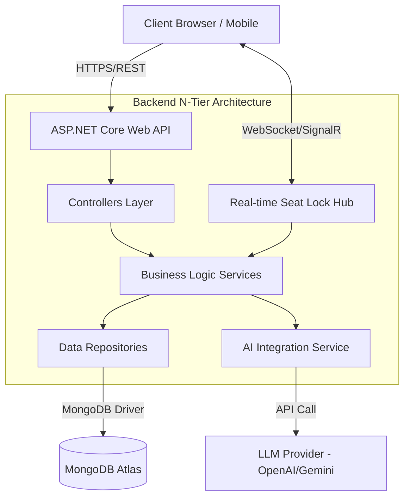

# Kiến trúc Hệ thống (System Architecture)

## 1. Tổng quan Kiến trúc
Dự án `3HD2Kcinema` sử dụng mô hình Client-Server hiện đại, chia tách hoàn toàn giữa Frontend và Backend. 
- **Frontend:** Ứng dụng Single Page Application (SPA) xây dựng bằng ReactJS.
- **Backend:** Hệ thống RESTful API xây dựng bằng ASP.NET Core.
- **Database:** NoSQL MongoDB.

## 2. Sơ đồ Kiến trúc (Mermaid)

## 3. Lựa chọn Công nghệ
- **ReactJS (TypeScript) + Tailwind CSS:** Quản lý giao diện, trạng thái (state), gọi API từ Backend. Đảm bảo UI mượt mà, phản hồi nhanh.
- **ASP.NET Core Web API:** Kiến trúc N-Tier rõ ràng, hiệu năng cao, bảo mật tốt (sử dụng JWT).
- **MongoDB:** Linh hoạt lưu trữ dữ liệu dạng Document, rất phù hợp cho cấu trúc dữ liệu đa dạng của ứng dụng rạp phim (suất chiếu, thông tin phim, danh sách ghế).
- **SignalR:** Giải quyết bài toán khóa ghế theo thời gian thực (Real-time Seat Locking).

## 4. Vị trí tích hợp AI
Tính năng AI (Phân tích cảm xúc từ Review) được tích hợp ở tầng **Services** của Backend. Khi Frontend yêu cầu tóm tắt đánh giá phim, Backend sẽ gọi API của LLM Provider (ví dụ: OpenAI hoặc Gemini), nhận kết quả phân tích và trả về cho Frontend hiển thị.
