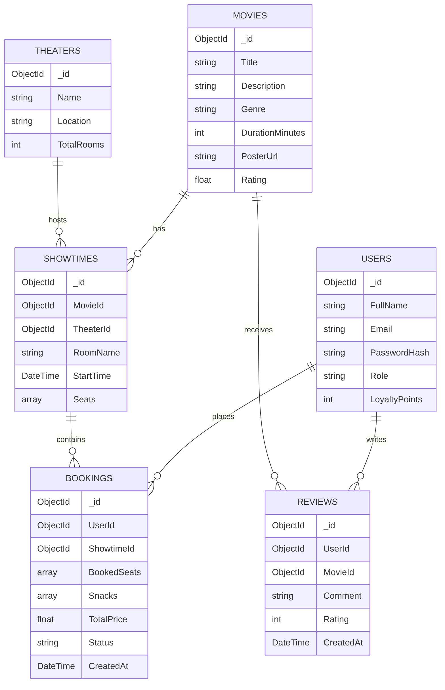

# Thiết kế Cơ sở dữ liệu (Data Model)

Dự án sử dụng cơ sở dữ liệu phi quan hệ (NoSQL) là **MongoDB**. Dưới đây là cấu trúc các Collection chính.

## Sơ đồ Thực thể

## Giải thích các Collection
- **Users:** Lưu trữ thông tin khách hàng, điểm thành viên, tài khoản đăng nhập.
- **Movies:** Dữ liệu phim, bao gồm thời lượng, ảnh poster, thông tin cơ bản.
- **Theaters:** Thông tin các cụm rạp, địa chỉ.
- **Showtimes:** Chi tiết suất chiếu. Do MongoDB là dạng document, cấu trúc mảng `Seats` (chứa trạng thái ghế Trống/Đã đặt) có thể được lưu trữ trực tiếp (embedded document) bên trong mỗi Showtime để dễ truy vấn trạng thái ghế.
- **Bookings:** Thông tin giao dịch đặt vé và mua bắp nước.
- **Reviews:** Chứa đánh giá của người dùng. Collection này sẽ là dữ liệu đầu vào (Input) cho tính năng AI phân tích cảm xúc.
