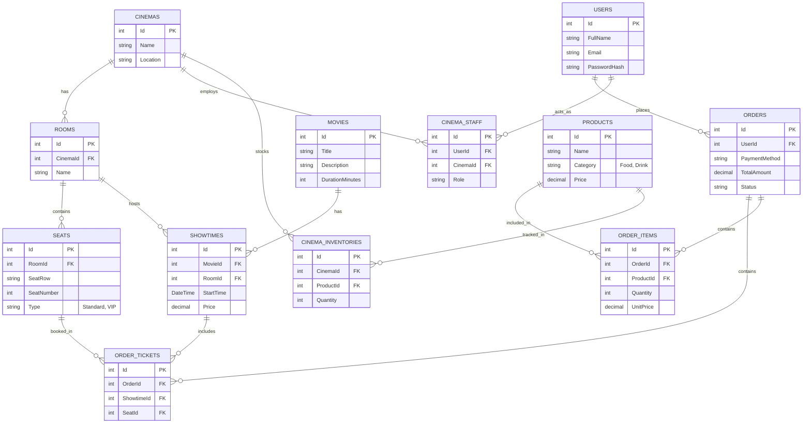

# Thiết kế Cơ sở dữ liệu (Data Model)

Dự án sử dụng cơ sở dữ liệu quan hệ (Relational Database) là **SQL Server** thông qua Entity Framework Core (`ApplicationDbContext`). Dưới đây là cấu trúc các thực thể chính trong hệ thống quản lý rạp phim 3HD2Kcinema.

## 1. Sơ đồ Thực thể (ERD)

## 2. Hệ thống Quản lý Rạp chiếu phim (Thành phần cơ sở hạ tầng)
- **Cinemas & Rooms:** Quản lý danh sách rạp và các phòng chiếu theo từng địa điểm.
- **Seats:** Hệ thống ghế ngồi cố định trong mỗi phòng (Phân loại: Standard, VIP).

## 3. Hệ thống Quản lý Rạp chiếu phim (Thực thể người dùng)
- **Users:** Quản lý thông tin khách hàng và tài khoản nhân viên.
- **Cinema Staff:** Phân quyền nhân viên quản lý theo từng rạp cụ thể.

## 4. Quy trình Lập lịch & Đặt vé trực tuyến
- **Lịch chiếu (Showtimes):** 
  - Điểm kết nối giữa Phim (Movies), Phòng chiếu (Rooms) và Thời gian.
  - Thiết lập mức giá vé riêng cho từng suất chiếu.
- **Luồng Đặt vé (Booking Flow):**
  - **Orders:** Đơn hàng tổng (lưu phương thức thanh toán, tổng tiền, trạng thái vé).
  - **Order Tickets:** Chi tiết vé đặt (liên kết mã đơn hàng với mã ghế và suất chiếu).
  - **Ràng buộc logic:** Đảm bảo mỗi vị trí ghế chỉ được đặt duy nhất một lần cho mỗi suất chiếu (Unique Constraint).

## 5. Tối ưu hóa doanh thu & kiểm soát kho
- **Dịch vụ Bắp nước (Concessions):**
  - **Products:** Danh mục sản phẩm đồ ăn, thức uống và đơn giá.
  - **Order Items:** Chi tiết các sản phẩm khách hàng mua kèm trong đơn hàng tổng.
- **Quản lý Kho (Inventory Management):**
  - **Cinema Inventories:** Theo dõi số lượng tồn kho thực tế của từng sản phẩm theo từng rạp. 
  - Giúp hệ thống tự động cập nhật và cảnh báo khi sản phẩm tại một chi nhánh sắp hết.
- **Tính đa dụng:** Hệ thống hỗ trợ cả đặt vé trực tuyến (Online) và bán trực tiếp tại quầy (Counter).
